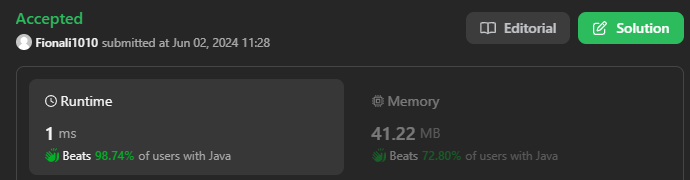
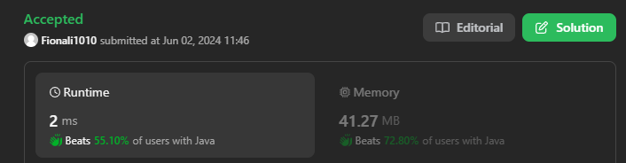

# 20. Valid Parentheses

## Approach 1



```java
class Solution {
    public boolean isValid(String s) {
        if (s.length() % 2 != 0) return false;
        Deque<Character> stack = new ArrayDeque<>();
       
        for (char c: s.toCharArray()) {
            if (c == '(' || c == '[' || c == '{') {
                stack.push(c);
            } else {
                if (stack.isEmpty()) return false;
                char cur = stack.pop();
                if (c == ')' && cur != '(' ||
                    c == ']' && cur != '[' ||
                    c == '}' && cur != '{'
                ) {
                    return false;
                }
            }
        }
        return stack.isEmpty();
    }
}
```


## Approach 2



```java
class Solution {
    public boolean isValid(String s) {
        HashMap<Character, Character> map = new HashMap<>();
        map.put('(', ')');
        map.put('[', ']');
        map.put('{', '}');
        Deque<Character> stack = new ArrayDeque<>();

        for (Character c: s.toCharArray()) {
            if (map.containsKey(c)) {
                stack.push(c);
            } else {
                if (stack.isEmpty()) return false;
                char ch = stack.pop();
                if (map.get(ch) != c) return false;
            }
        }
        return stack.isEmpty();
    }
}
```