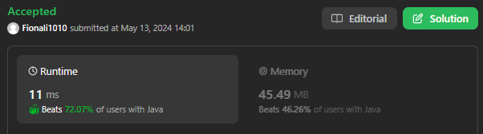

# 649. Dota2 Senate

## Approach 1
[Explaination](https://leetcode.com/problems/dota2-senate/?envType=study-plan-v2&envId=leetcode-75) 



```java
class Solution {
    public String predictPartyVictory(String senate) {
        Queue<Integer> rad = new LinkedList<>(), dir = new LinkedList<>();
        int n = senate.length();
        // Add all senators to respect queue with index
        for (int i = 0; i < n; i++){
            if (senate.charAt(i) == 'R'){
                rad.add(i);
            } else {
                dir.add(i);
            }
        }
        // Use increasing n to keep track of position
        while (!rad.isEmpty() && !dir.isEmpty()){
            // Only "winner" stays in their queue
            if (rad.peek() < dir.peek()){
                rad.add(n++);
            } else {
                dir.add(n++);
            }
            rad.poll();
            dir.poll();
        }
        return (rad.isEmpty()) ? ("Dire") : ("Radiant");
    }
}

```
- The time complexity of this solution is O(n), where n is the length of the input string senate. This is because the algorithm iterates through each character in the senate string once to determine the initial queues (rad and dir) and then iterates through the queues until one of them is empty.

- The space complexity is also O(n) in the worst case scenario. This is because the rad and dir queues can each contain up to n/2 elements (for example, if the input string senate consists of alternating 'R' and 'D' characters), and the algorithm may also create additional elements in the queues using n++. Additionally, the algorithm uses a constant amount of extra space for variables like n and the loop index i.