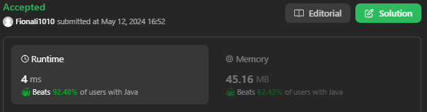
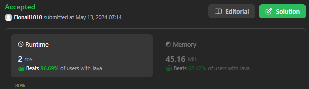

# 735. Asteroid Collision

## Approach 1 by Lei

只有当前一颗星是正后一颗星星是负的才会发生碰撞，其他情况都可以safely push to element stack

- 发生碰撞的三种情况 int top = stack.peek();
    -  case 1: asteroid abs > top, top explode， 我们需要continue 去检查stack里面的下一个元素和当前的比会不会碰撞
    - case 2: top == abs asteroid， 双方都保证，remove top from stack, 因为当下元素也爆照了，我们需要继续下一个星星
    - case 3: top > -asteroid 不用remove top from stack, 因为当下元素也爆照了，我们需要继续下一个星星

- time O(N)
- space O(N)

```java
// 推荐写法
class Solution {
    public int[] asteroidCollision(int[] asteroids) {
        Deque<Integer> stack = new ArrayDeque<>();

        for (int asteroid: asteroids) {
            boolean alive = true;

            while (!stack.isEmpty() && stack.peek() > 0 && asteroid < 0) {
                int top = stack.peek();
                // case 1: asteroid abs > top, top explode
                if (top < -asteroid) {
                    stack.pop();
                    continue;
                } else if (top == -asteroid) {
                    // case 2: top == abs asteroid
                    stack.pop();
                } 
                // case 3: top > -asteroid && case 2
                    alive = false;
                    break;
            }
            if (alive) stack.push(asteroid);
        }

        int n = stack.size();
        int[] res = new int[n];
        for (int i = n-1; i >= 0 && n > 0; i--) {
            res[i] = stack.pop();
        }   

        return res;
    }
}

```

```java
class Solution {
    public int[] asteroidCollision(int[] asteroids) {
        // input: array of integers
        Stack<Integer> stack = new Stack<>();
        List<Integer> res = new ArrayList<>();
        int i = 0;
        
        while ( i < asteroids.length) {
            int num = asteroids[i];
            if (!stack.isEmpty() && stack.peek() > 0 && num < 0) {
                if (Math.abs(stack.peek()) < Math.abs(num)) {
                    stack.pop();
                } else if (Math.abs(stack.peek()) == Math.abs(num)) {
                     stack.pop();
                     i++;
                } else {
                    i++;
                }
            } else {
                stack.push(num);
                i++;
            }
        }

        while(!stack.isEmpty()) {
            res.add(stack.pop());
        }

        Collections.reverse(res);

        int[] result = new int[res.size()];
        for (int j = 0; j < res.size(); j++) {
            result[j] = res.get(j);
        }
        
        return result;
    }
}
```

## Approach 2 by Lei



```java
class Solution {
     public int[] asteroidCollision(int[] asteroids) {
        List<Integer> res = new ArrayList<>();
        int i = 0;
        
        while (i < asteroids.length) {
            int num = asteroids[i];
            int size = res.size();
            if (size > 0 && res.get(size-1) > 0 && num < 0) {
                int last = res.get(size-1);
                if (Math.abs(last) < Math.abs(num)) {
                    res.remove(size-1);
                } else if (Math.abs(last) == Math.abs(num)) {
                    res.remove(size-1);
                    i++;
                } else {
                    i++;
                }
            } else {
                res.add(num);
                i++;
            }
        }

        int[] result = new int[res.size()];
        for (int j = 0; j < res.size(); j++) {
            result[j] = res.get(j);
        }

        return result;
    }
}

```

## Approach 3



```java
class Solution {
    public int[] asteroidCollision(int[] asteroids) {
        List<Integer> stack = new ArrayList<>();

        for (int num : asteroids) {
            int size = stack.size();
            while (size > 0 && num < 0 && stack.get(size - 1) > 0) {
                int diff = num + stack.get(size - 1);
                if (diff < 0) {
                    stack.remove(size - 1);
                    size--; // Update the size after removing an element, actual size 已经变了，但size 这个变量因为code的写法没有变，需要手动改变，如果全部用stack.size(),就不用手动改
                } else if (diff > 0) {
                    num = 0;
                } else {
                    stack.remove(size - 1);
                    num = 0;
                    size--; // Update the size after removing an element
                }
            }

            if (num != 0) {
                stack.add(num);
            }
        }

        int[] result = new int[stack.size()];
        for (int j = 0; j < stack.size(); j++) {
            result[j] = stack.get(j);
        }

        return result;
    }
}
```