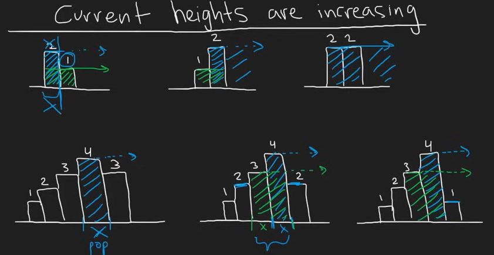
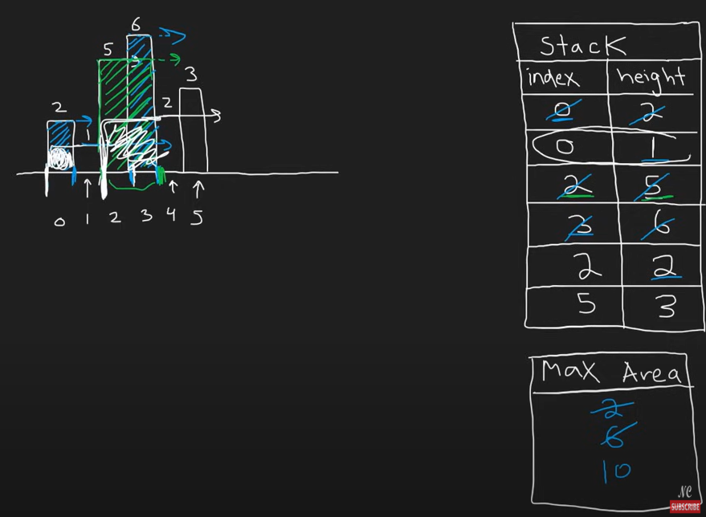

# 84 Largest Rectangle in Histogram

## Approach 1 




- 写法 1：

```java
class Solution {
    public int largestRectangleArea(int[] heights) {
        Deque<Integer> stack = new ArrayDeque<>();
        stack.push(-1);
        int max = 0, N = heights.length;

        for (int i = 0; i < N; i++) {
            while (stack.peek() != -1 && heights[stack.peek()] >= heights[i]) {
                int preHeight = heights[stack.pop()];
                int width = i - stack.peek() - 1;
                max = Math.max(max, preHeight * width);
            }
            stack.push(i);
        }

        while (stack.peek() != -1) {
            int preHeight = heights[stack.pop()];
            int width = N - stack.peek() - 1;
            max = Math.max(max, preHeight * width);
        }

        return max;
    }
}
```

- 写法 2：

```java
class Solution {
    public int largestRectangleArea(int[] heights) {
        Deque<int[]> stack = new ArrayDeque<>();
        int max = 0, N = heights.length;

        for (int i = 0; i < N; i++) {
            int start = i;
            while (!stack.isEmpty() && stack.peek()[1] > heights[i]) {
                start = stack.peek()[0];
                int size = sizeCalulator(stack, i);
                max = Math.max(size, max);
            }
            stack.push(new int[]{start, heights[i]});
        }   
        
        while (!stack.isEmpty()) {
            int size = sizeCalulator(stack, N);
            max = Math.max(size, max);  
        }

        return max;
    }

    private int sizeCalulator(Deque<int[]> stack, int N) {
        int[] cur = stack.pop();
        int height = cur[1];
        int idx = cur[0];
        int size = height * (N - idx);
        return size;
    }
}
```

- 写法 3：

```java
class Solution {
    public int largestRectangleArea(int[] heights) {
        Deque<int[]> stack = new ArrayDeque<>();
        int max = 0, N = heights.length;

        for (int i = 0; i < N; i++) {
            if (!stack.isEmpty() && heights[i] < stack.peek()[1]) {
                int idx = 0;
                while (!stack.isEmpty() && stack.peek()[1] > heights[i]) {
                    int[] cur = stack.pop();
                    int height = cur[1];
                    idx = cur[0];
                    int size = height * (i - idx);
                    max = Math.max(size, max);  
                }
                stack.push(new int[]{idx, heights[i]});
                continue;
            } 
                
            stack.push(new int[]{i, heights[i]});
        }   
        
        while (!stack.isEmpty()) {
            int[] cur = stack.pop();
            int height = cur[1];
            int idx = cur[0];
            int size = height * (N - idx);
            max = Math.max(size, max);  
        }

        return max;
    }
}
```
