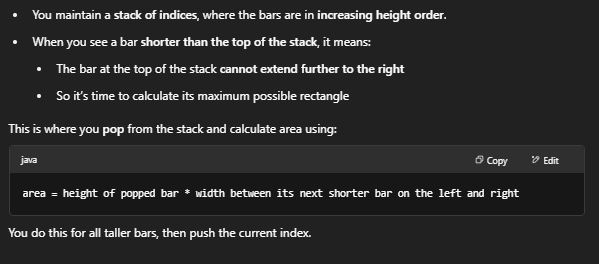

# 84 Largest Rectangle in Histogram

## Intuition

The goal is to find the largest rectangular area in a histogram formed by bars of different heights. Each bar has width = 1.

-  compute the largest rectangle:
    - You need to find, for every bar, how far it can extend to the right while still being taller or equal than the current bar. 也就是说当bar单调递增时我们不用计算面积，当遇到一个bar比前面矮时， 我们需要计算面积了
    - 这道题的难点之一是如何计算width, 写法一和写法二都用了sentinel 的方法
    - Doing this by brute-force is O(n²), so we use a stack-based approach to do it in O(n).

## Approach - Monotonic Increasing Stack




### 写法 1

```java
class Solution {
    public int largestRectangleArea(int[] heights) {
        Deque<Integer> stack = new ArrayDeque<>();
        int max = 0;
        int N = heights.length;

        for (int i = 0; i <= N; i++) {
            int curHeight = i == N? 0: heights[i];

            while (!stack.isEmpty() && curHeight < heights[stack.peek()]) {
                int height = heights[stack.pop()];
                int width = stack.isEmpty()? i: i - stack.peek()-1;
                max = Math.max(max, height * width);
            }
            stack.push(i);
        }
        return max;
    }
}
```


### 写法 2：

- stack.push(-1) is a key step to simpify width calculation
- 另一个计算width的诀窍是是 i减去pop之后的前面一个indx, 这样能保证这个完整的向右边extend 同时也不用存一个node同时还要update indx用于计算width

```java
class Solution {
    public int largestRectangleArea(int[] heights) {
        Deque<Integer> stack = new ArrayDeque<>();
        stack.push(-1); // Add a sentinel idx of -1 at the beginning to simpify width calculation
        int max = 0, N = heights.length;

        for (int i = 0; i < N; i++) {
            while (stack.peek() != -1 && heights[stack.peek()] >= heights[i]) {
                int preHeight = heights[stack.pop()];
                int width = i - stack.peek() - 1;
                max = Math.max(max, preHeight * width);
            }
            stack.push(i);
        }

        while (stack.peek() != -1) {
            int preHeight = heights[stack.pop()];
            int width = N - stack.peek() - 1;
            max = Math.max(max, preHeight * width);
        }

        return max;
    }
}
```

### 写法 3：

```java
class Solution {
    public int largestRectangleArea(int[] heights) {
        Deque<int[]> stack = new ArrayDeque<>();
        int max = 0, N = heights.length;

        for (int i = 0; i < N; i++) {
            int start = i;
            while (!stack.isEmpty() && stack.peek()[1] > heights[i]) {
                start = stack.peek()[0];
                int size = sizeCalulator(stack, i);
                max = Math.max(size, max);
            }
            stack.push(new int[]{start, heights[i]});
        }   
        
        while (!stack.isEmpty()) {
            int size = sizeCalulator(stack, N);
            max = Math.max(size, max);  
        }

        return max;
    }

    private int sizeCalulator(Deque<int[]> stack, int N) {
        int[] cur = stack.pop();
        int height = cur[1];
        int idx = cur[0];
        int size = height * (N - idx);
        return size;
    }
}
```

### 写法 4：

```java
class Solution {
    public int largestRectangleArea(int[] heights) {
        Deque<int[]> stack = new ArrayDeque<>();
        int max = 0, N = heights.length;

        for (int i = 0; i < N; i++) {
            if (!stack.isEmpty() && heights[i] < stack.peek()[1]) {
                int idx = 0;
                while (!stack.isEmpty() && stack.peek()[1] > heights[i]) {
                    int[] cur = stack.pop();
                    int height = cur[1];
                    idx = cur[0];
                    int size = height * (i - idx);
                    max = Math.max(size, max);  
                }
                stack.push(new int[]{idx, heights[i]});
                continue;
            } 
                
            stack.push(new int[]{i, heights[i]});
        }   
        
        while (!stack.isEmpty()) {
            int[] cur = stack.pop();
            int height = cur[1];
            int idx = cur[0];
            int size = height * (N - idx);
            max = Math.max(size, max);  
        }

        return max;
    }
}
```
