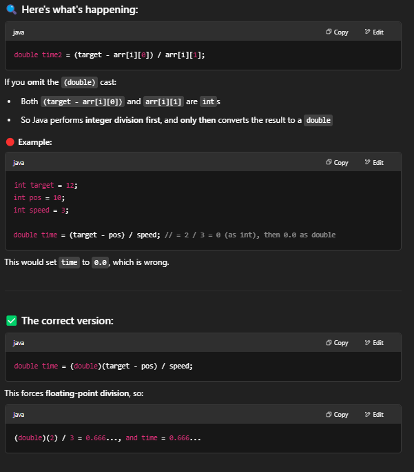

# 853. Car Fleet

- 合并position and speed, 变成int[][]
- sort by position
- 从positin 最大的开始loop, 计算需要到达target的时间
    - 时间一定要是double, 否侧无法完全区分大小
- 把时间，后一个比较前一个，如果时间 <= 前一个，说明：
    - 两者会相遇，是同一个fleet
    - 后者比前者速度快，可以忽略了


## Appraoch 1 - stack
### 写法1
```java
class Solution {
    public int carFleet(int target, int[] position, int[] speed) {
        int[][] arr = new int[position.length][2];
        Deque<Double> stack = new ArrayDeque<>();

        for (int i = 0; i < position.length; i++) {
            arr[i] = new int[]{position[i], speed[i]};
        }
        Arrays.sort(arr, (a,b) -> (b[0]-a[0]));

        for (int i = 0; i < arr.length; i++) {
            double time2 = (double)(target-arr[i][0])/arr[i][1];
            if (stack.isEmpty()) {
                stack.push(time2);
                continue;
            }
            double time1 = stack.peek();
            if (time2 > time1) stack.push(time2);
        }
        return stack.size();
    }
}
```

### 写法2
```java
class Solution {
    public int carFleet(int target, int[] position, int[] speed) {
        Deque<int[]> stack = new ArrayDeque<>();
        int[][] arr = new int[position.length][2];

        for (int i = 0; i < position.length; i++) {
            arr[i] = (new int[]{position[i], speed[i]});
        }
        Arrays.sort(arr, (a,b) -> (a[0] == b[0]? b[1]-a[1]: a[0]-b[0]));

        for (int i = position.length-1; i >= 0; i--) {
            if (stack.isEmpty()) {
                stack.push(arr[i]);
                continue;
            }
            double time1 = (double)(target-stack.peek()[0])/stack.peek()[1];
            double time2 = (double)(target-arr[i][0])/arr[i][1];
            if (time2 > time1) {
                stack.push(arr[i]);
            }

        }
        return stack.size();
    }
}
```

## Approach 2 - Array
```java
class Solution {
    public int carFleet(int target, int[] position, int[] speed) {
        int n = position.length;
        if (n == 0) return 0;

        // Pair up position and time to reach target
        double[][] cars = new double[n][2];
        for (int i = 0; i < n; i++) {
            cars[i][0] = position[i];
            cars[i][1] = (double)(target - position[i]) / speed[i];
        }

        // Sort cars by position in descending order
        Arrays.sort(cars, (a, b) -> Double.compare(b[0], a[0]));

        int fleets = 0;
        double lastTime = 0;

        for (int i = 0; i < n; i++) {
            double currentTime = cars[i][1];
            if (currentTime > lastTime) {
                fleets++;
                lastTime = currentTime;
            }
        }
        return fleets;
    }
}
```

