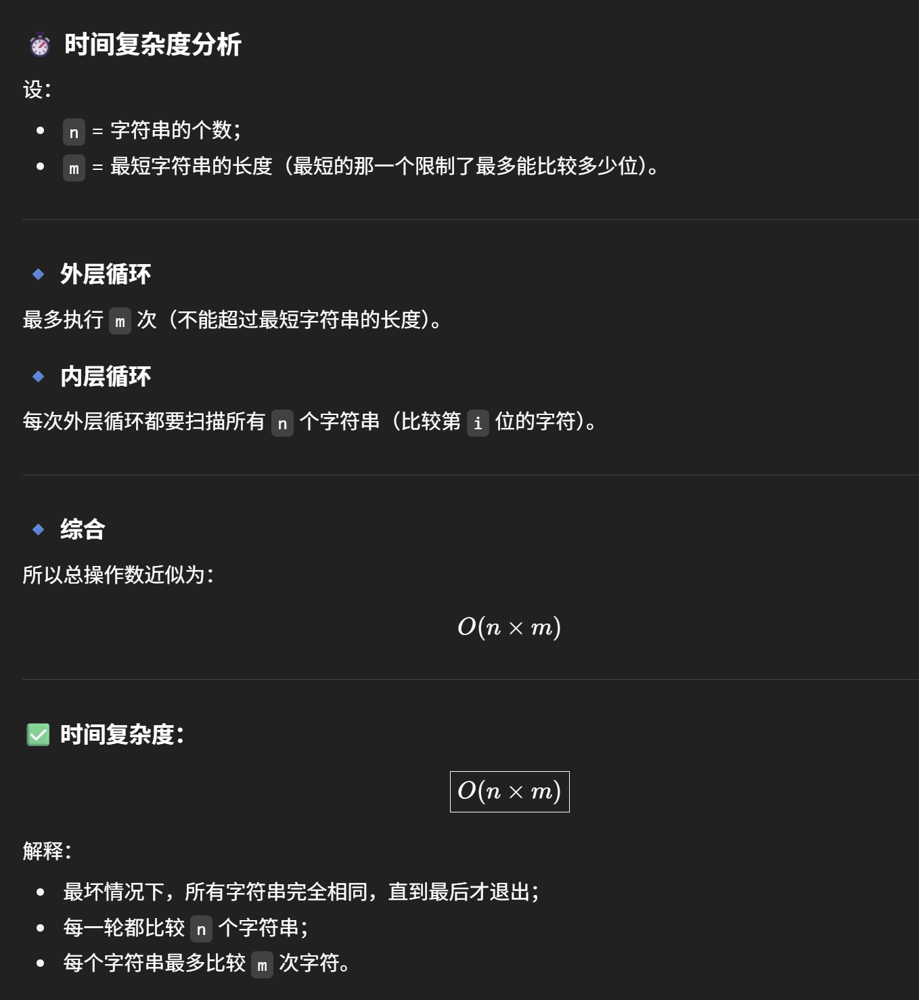

# 14. Longest Common Prefix

- out loop: strs[0]
- inner loop: every str in the strs array

```java
class Solution {
    public String longestCommonPrefix(String[] strs) {
        if (strs == null || strs.length == 0) return "";
        
        StringBuilder sb = new StringBuilder();
        
        for (int i = 0; i < strs[0].length(); i++) {
            char c = strs[0].charAt(i);
            // for each char in strs[0], we loop through all str and compare if they have the same char
            for (String str: strs) {
                if (i == str.length() || str.charAt(i) != c) return sb.toString();
            }
                sb.append(c); // 一定要在outer loop append 不然同一个char 会append多次 
        }
        return sb.toString();
    }
}
```


- space: O(1)