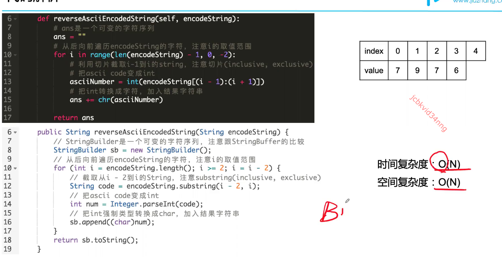
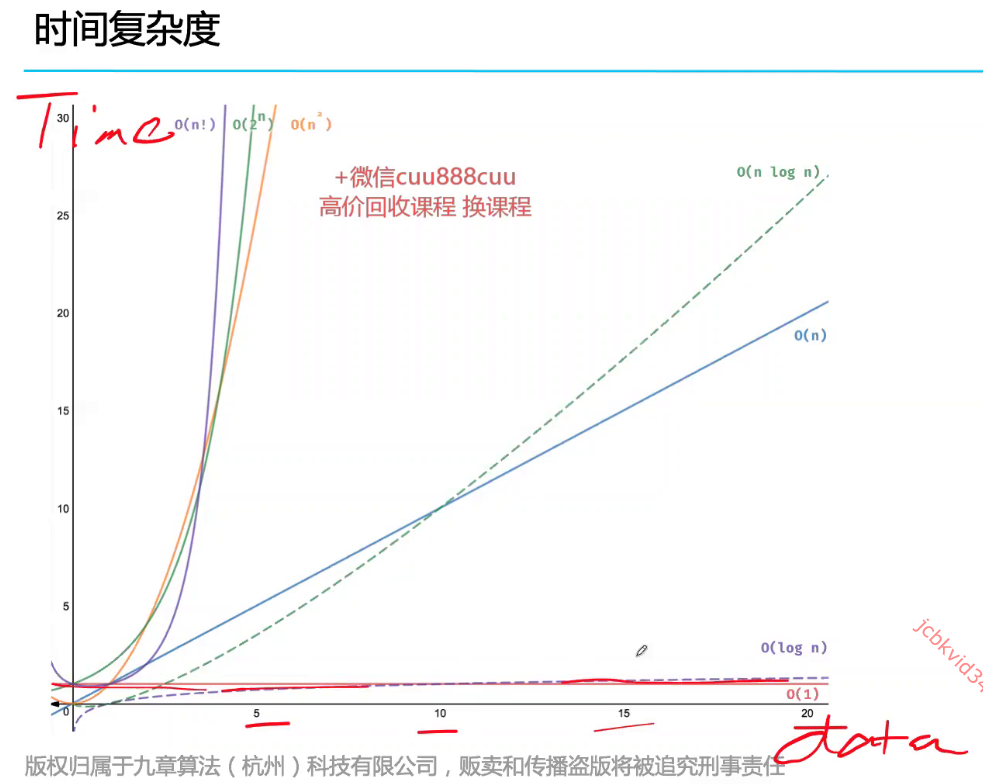
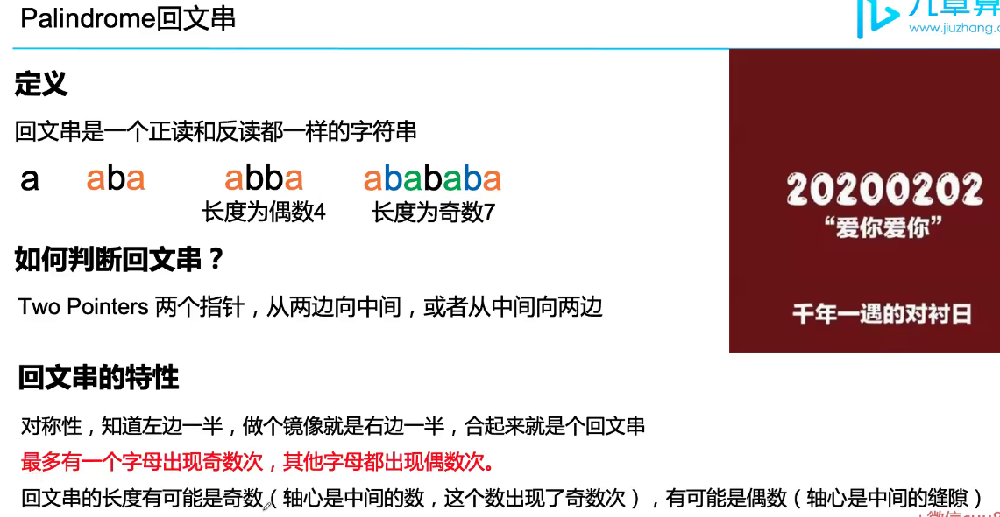
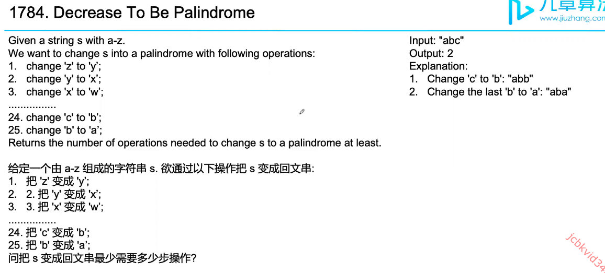
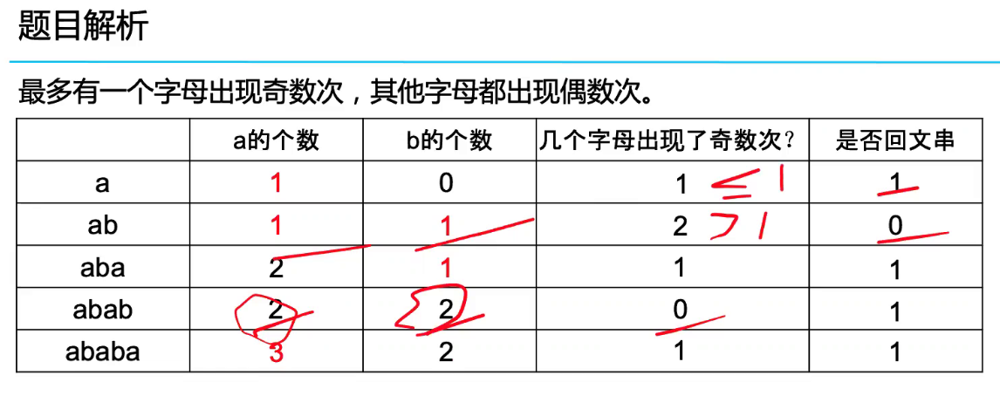
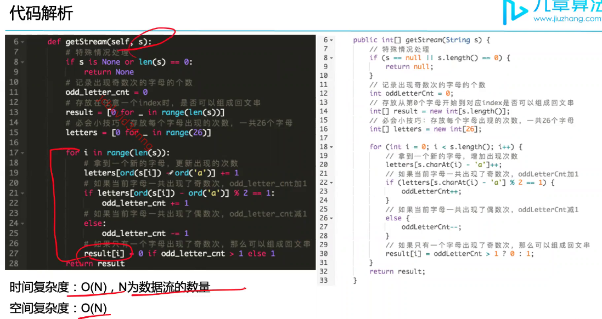
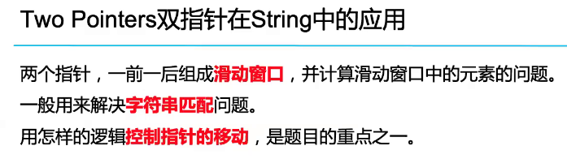
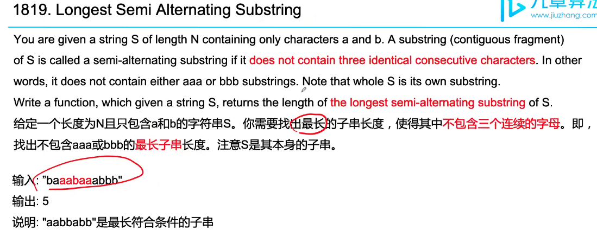
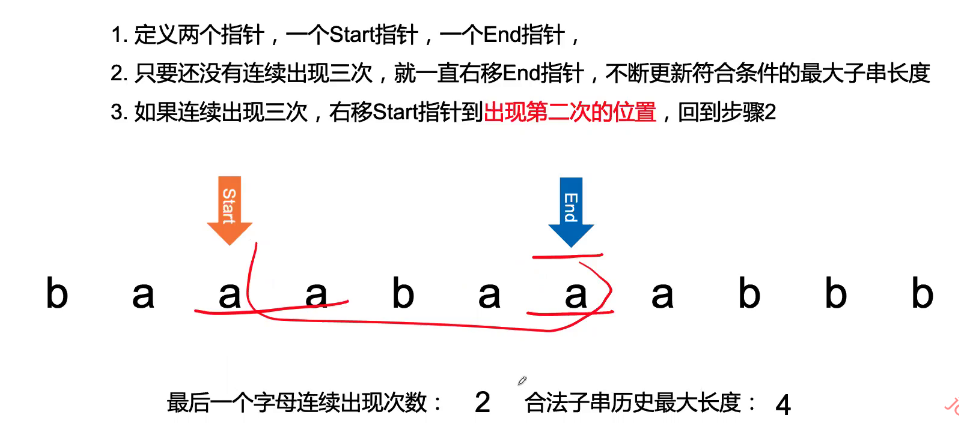

# String

## Commands

### More comands
- StringBuilder
  - StringBuilder could be modified while String is immutable
  - StringBuilder sb = new StringBuilder(5); You can set up the string length to 5, default is 16.
  - How to add string to StringBuilder? sb.append("a").append(" ");
  - How to convert StringBuilder to String? sb.toString()

## Practice 

### Analysis 
Only uppercase letter, 减少了难度， 因为每个大写字母对应2个数字，lowercase对应3位数字，你就要考虑怎么划分数字串

## Practice

## Practice

Two pointers: 
- 相向双指针 （向中间靠拢）；
- 同向双指针 （在同一端，向另一端移动） 
- 北向双指针 （两个指针在中间，背道而驰）；

