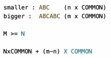

# 1071. Greatest Common Divisor of Strings
[Leetcode 1071 (Easy)][1071]

[1071]: https://leetcode.com/problems/greatest-common-divisor-of-strings/description/

[Tutorial video][Turotial]

[Turotial]:https://www.youtube.com/watch?v=41iKYE0n0PQ

## Approach 1
- smaller string will always be a substring of bigger string, if not return "". Which means bigger string starts with smaller string, or return ""
- for the bigger string which starts with the smaller string, we need remove the smaller from the bigger, and recursively compare the remainder and smaller.

    

```java
// recursion
class Solution {
    public String gcdOfStrings(String str1, String str2) {
        String bigger = str1.length() > str2.length()? str1: str2;
        String smaller = str1.length() > str2.length()? str2: str1;

        // base case
        if (bigger.equals(smaller)) return smaller; // return either one
        
        if (bigger.startsWith(smaller)) {
            return gcdOfStrings(bigger.substring(smaller.length()), smaller); // substring method remove the smaller from the bigger
        }
        
        return ""; // if bigger.startsWith(smaller) is false, return ""
    }
}
```
- Time: O(n)
  - The time complexity of your code is O(N + M), where N is the length of str1 and M is the length of str2. This is because in each recursive call, the startsWith method and the substring method both take O(min(N, M)) time. The recursion depth is at most max(N, M), so the overall time complexity is O(N + M).

- Space: O(n)
  - The space complexity is O(N + M), where N is the length of str1 and M is the length of str2. This is due to the recursion stack space, which can be at most max(N, M) frames deep. Additionally, the space complexity is affected by the bigger and smaller strings, but they are not part of the recursion stack, so the overall space complexity remains O(N + M).

In summary, your gcdOfStrings method has a time complexity of O(N + M) and a space complexity of O(N + M).

## Approach 1 - find greatest common divisor of two strings' length

```java
public String gcdOfStrings(String str1, String str2) {
        if (!(str1 + str2).equals(str2 + str1)) {
            return "";
        }
        int gcdLength = gcd(str1.length(), str2.length());
        return str1.substring(0, gcdLength);
    }
    
    // how to find greatest common divisor of two integers
    public int gcd(int x, int y) {
            if (y == 0) {
                return x;
            } else {
                return gcd(y, x % y);
            }    
    }

```