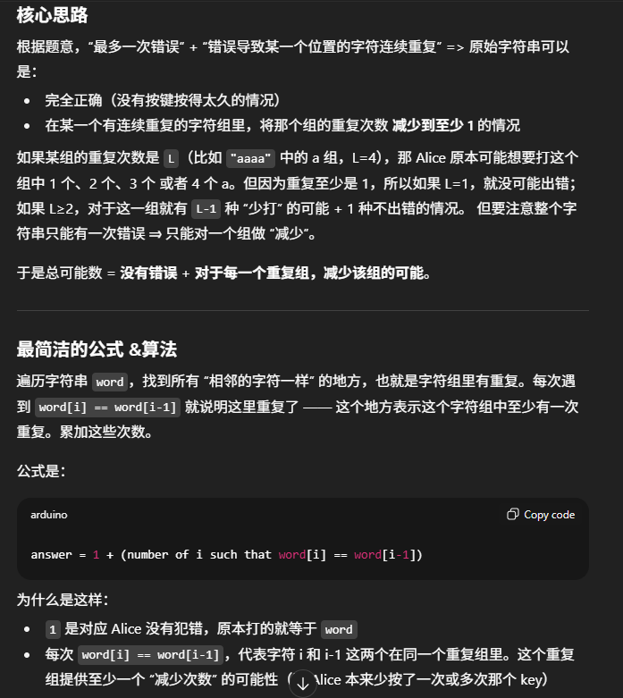

# 3330. Find the Original Typed String I



```java
class Solution {
    public int possibleStringCount(String word) {
        int res = 1; 
        for (int i = 1; i < word.length(); i++) {
            if (word.charAt(i) == word.charAt(i-1)) res++;
        }

        return res;
    }
}
```