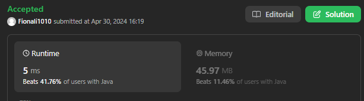

# 345. Reverse Vowels of a String

[Leetcode 345 (Easy)][345]

[345]: https://leetcode.com/problems/reverse-vowels-of-a-string/?envType=study-plan-v2&envId=leetcode-75

## Approach 1


```java
class Solution {
    public String reverseVowels(String s) {
        char[] chars = s.toCharArray();
        int start = 0;
        int end = chars.length -1;

        // while loop 里面每一个while和if仍然要加上start < end, 不然++之后仍然会出现start >= end的情况
        while (start < end) {
            while (start < end && !isVowel(chars[start])) {
                start++; // while loop 让指针继续移动到是vowel的地方
            }

            while (start < end && !isVowel(chars[end])) {
                end--;
            }
            
            if (start < end) {
                swap (chars, start, end);
                start++; //swap 之后继续移动
                end--;
            }
        }
        return new String(chars); //这里不能return chars.toString() -- '[h,o,l,l,e]' 
    }

    private boolean isVowel(char c) {
        return c == 'a' || c == 'e' || c == 'i' || c == 'o' || c == 'u' || c == 'A' || c == 'E' || c == 'I' || c == 'O' || c == 'U';
    }

    private void swap(char[] str, int start, int end) {
        char temp = str[end];
        str[end] = str[start];
        str[start] = temp;
    }
}

```

## Appraoch 2



```java

class Solution {
    public String reverseVowels(String s) {
        // input: string, in lowercase or uppercase
        // output: string with reversed vowels
        // constraints: string not empty

        // steps:
        // 1. a vowel string "aeiouAEIOU";
        // 2. two pointers, start and end. if both point to vowels, switch;

    String vowels = "aeiouAEIOU";
    int start = 0;
    int end = s.length()-1;
    char[] res = s.toCharArray();

    while (start < end) {
        if (!vowels.contains(String.valueOf(s.charAt(start)))) start++;
        else if (!vowels.contains(String.valueOf(s.charAt(end)))) end--;
        else {
            char temp = res[start];
            res[start] = res[end];
            res[end] = temp;
            start++;
            end--;
        }
    }
    return new String(res);

    }
}
```