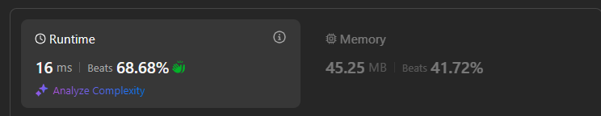

# 76. Minimum Window Substring



- 移动i or right pointer 是扩大窗口, 如果碰到target char, 需要对应value--, 表示加入到窗口，也表示需要找的数量减少。当value 变为0，count不能变了，因为所有target char都已经找到
- 移动左指针是缩小窗口，如果碰到target char, 需要对应value++, 表示加入到窗口，也表示需要找的数量增加。当value > 0, count--, 表示还有char需要找

```java
class Solution {
    public String minWindow(String s, String t) {
        // t contains duplicate chars, so we also need to count frequency of different characters
        // map的key代表这是一个target char, key对应的value代表我们需要找到多少个这样的char
        HashMap<Character, Integer> map = new HashMap<>();
         for (char c: t.toCharArray()) {
            map.put(c, map.getOrDefault(c, 0)+1);
        }
        
        // two pointers, left and i is the right iterator
        int left = 0, count = 0, minStart = 0, minLen = Integer.MAX_VALUE;
        for (int i = 0; i < s.length(); i++) {
            char cur = s.charAt(i);
            if (map.containsKey(cur)) {
                if (map.get(cur) > 0) count++; // 找到了target char
                map.put(cur, map.get(cur)-1); // 找到一个target char，我们就减少一个需要找的数量  
            }

            while (count == t.length()) { //此时在一段substring中找到了所有target chars, map中的value都为0，这不代表这是最短substring （只要count == t.length()，窗口就是valid
                // 先更新minLen, 在解决最短的问题
                if (i - left + 1 < minLen) {
                    minStart = left;
                    minLen = i - left + 1;
                }

                // 试图在当下这个已经合格的情况下找最短, 这一段比较难理解
                char c = s.charAt(left);
                if (map.containsKey(c)) {
                    map.put(c, map.get(c)+1); // 当character的value+1的时候表示我们把某个target char移除窗口
                    if (map.get(c) > 0) count--; // 当map中某个char的value > 0, 表示我们又需要开始找这个char了，当前窗口不valid了
                }
                
                left++;
            }
        }

        if (minLen == Integer.MAX_VALUE) return "";
        return s.substring(minStart, minStart+minLen);
    }
}

```