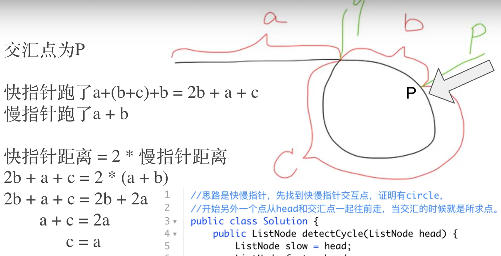
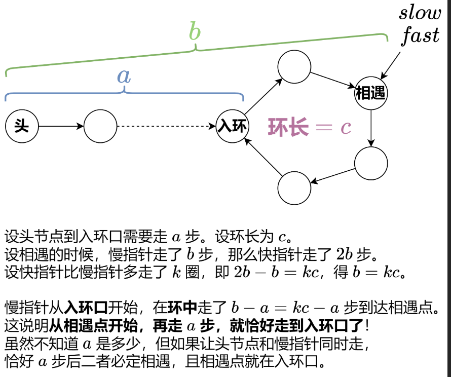

# 142. Linked List Cycle II
- 解释1


- 解释2


1. 向让快慢指针走直到相遇
2. 从相遇开始从slow & head各自往前走直到相遇，此时为环入口处

```java
public class Solution {
    public ListNode detectCycle(ListNode head) {
        ListNode slow, fast;
        slow = fast = head;

        while (fast != null && fast.next != null) {
            slow = slow.next;
            fast = fast.next.next;

            // 发现环之后进一步找出环起点
            if (slow == fast) {
                fast = head;
                while (slow != fast) {
                    fast = fast.next;
                    slow = slow.next;
                }
                return slow;
            }
        }
        return null;
    }
}
```
- time: O(N)
- space: O(1)