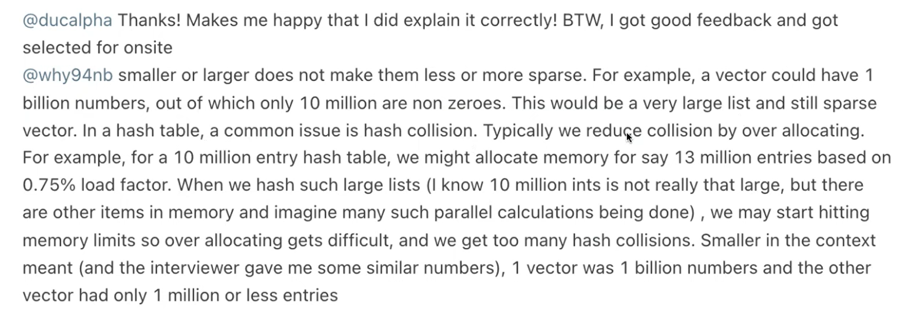

# 1570. Dot Product of Two Sparse Vectors

## Approach 1 - BinarySearch 更推荐
Follow up: What if only one of the vectors is sparse? 


- 太多数据造成hash collision 更花时间， 为了避免这种情况：
- 我们直接把数据存储到list里面，此处做一个优化，跳过0
    - 经过处理，vecs 的长度会不一样
- 比较两个vecs的大小，loop through 长度短的一个，这一步非常必要：
    - To minimize the number of binary search operations, we should always iterate through the smaller vector and search in the larger one.
    - This condition ensures that we loop through the vector with fewer non-zero elements (M) and perform binary search (O(log N)) on the larger vector (N), leading to an optimized time complexity of O(M log N).
    - int ans = v1.dotProduct(v2); 注意看ans的计算方法
        - v1是this.list, v2是vec.list, 我们会loop through v1, search idx in v2
        - 如果v2.size < v1.size, 更优化的做法是loop through v2, search idx in v1, 所以我们要在swap, return vec.dotProduct(v1)
        - 就记住 dotProduct(vec), 括号里的vec应该是长度更大的那个

```java
class SparseVector {
    List<int[]> list; // Stores (index, value) pairs only for non-zero elements

    SparseVector(int[] nums) {
        this.list = new ArrayList<>();
        for (int i = 0; i < nums.length; i++) {
            if (nums[i] != 0) { // Store only non-zero values
                list.add(new int[]{i, nums[i]});
            }
        }
    } // this wil result in vecs have different sizes

    // Return the dot product of two sparse vectors
    public int dotProduct(SparseVector vec) {
        if (vec.list.size() < this.list.size()) return vec.dotProduct(this);

        int dotProduct = 0;
        for (int[] pair : this.list) {
            int idx = pair[0];
            int value = pair[1];

            // Use binary search to find corresponding value in 'this' vector
            dotProduct += value * binarySearch(idx, 0, vec.list.size() - 1, vec.list);
        }
        return dotProduct;
    }

    // Binary search to find the value at a given index
    private int binarySearch(int idx, int left, int right, List<int[]> list) {
        while (left <= right) {
            int mid = left + (right - left) / 2;
            int midIdx = list.get(mid)[0];

            if (midIdx == idx) {
                return list.get(mid)[1]; // Found the index, return the value
            } else if (midIdx < idx) {
                left = mid + 1;
            } else {
                right = mid - 1;
            }
        }
        return 0; // Index not found, return 0
    }
}

// Your SparseVector object will be instantiated and called as such:
// SparseVector v1 = new SparseVector(nums1);
// SparseVector v2 = new SparseVector(nums2); 
// int ans = v1.dotProduct(v2);
```


## Approach 12 - HashMap
- 这道题并不是要go through 一个array然后两两相乘，sparse means稀疏，考虑怎么样可以skip那些0
- 前提： 两个vectors长度相等

```java
class SparseVector {
    public Map<Integer, Integer> map;
    
    SparseVector(int[] nums) {
        this.map = new HashMap<>();
        for (int i = 0; i < nums.length; i++) {
            if (nums[i] != 0) {
                map.put(i, nums[i]);
            }
        }
    }
    
	// Return the dotProduct of two sparse vectors
    public int dotProduct(SparseVector vec) {
        if (vec.map.size() < this.map.size()) return vec.dotProduct(this); // loop through size小的vector
        int res = 0;
        for (int i: this.map.keySet()) {
            if (vec.map.containsKey(i)) {
                res += this.map.get(i) * vec.map.get(i);
            }
        }
        return res;
    }
}

// Your SparseVector object will be instantiated and called as such:
// SparseVector v1 = new SparseVector(nums1);
// SparseVector v2 = new SparseVector(nums2);
// int ans = v1.dotProduct(v2);
```

