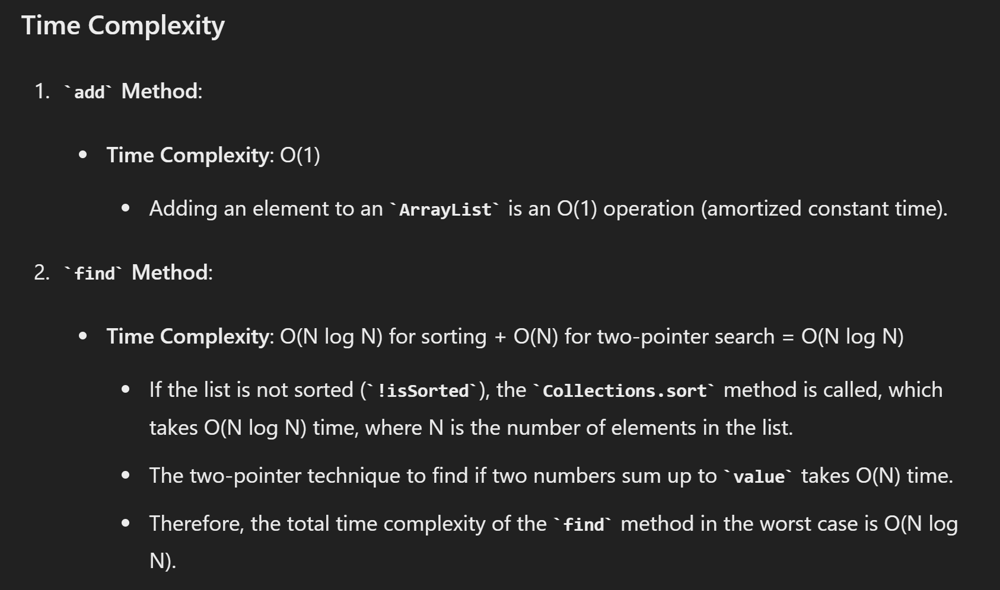
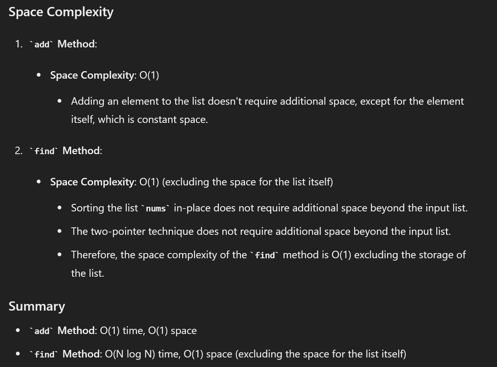
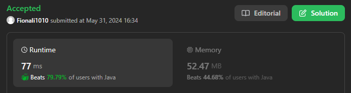

# 170. Two Sum III - Data Structure Design

## Approach 1 - two pointers
- insertion sort: 插入数的同时保持数组有序性
- 会超时，但是也是一种方法
- AddNumber - O(N)
- FindTwoSum - O(N)

```java
class TwoSum {

    private List<Integer> nums;
    private boolean isSorted;

    public TwoSum() {
        nums = new ArrayList<>(); 
        isSorted = false;
    }
    
    public void add(int number) {
        nums.add(number);
        isSorted = false;
    }
    
    public boolean find(int value) {
        if (!isSorted) {
             Collections.sort(nums);
             isSorted = true;
        }
       
         int low = 0, high = nums.size() - 1;
        while (low < high) {
            int twosum = nums.get(low) + nums.get(high);
            if (twosum < value) low += 1;
            else if (twosum > value) high -= 1;
            else return true;
        }
        return false;
    }
}
```




## Appraoch 2 - use hashmap



- 为什么用hashmap 而不是用hashset？
    - 因为我们需要记录每个数字出现的次数。如果 key = 3, value = 6, target = 3, 此时我们需要知道map里面有两个或以上的3，如果不记录次数，无法判断，会出错

```java
import java.util.HashMap;

class TwoSum {

    private HashMap<Integer, Integer> nums;

    public TwoSum() {
        nums = new HashMap<>();
    }
    
    public void add(int number) {
        nums.put(number, nums.getOrDefault(number, 0) + 1); // O(1)
    }
    
    public boolean find(int value) {
        for (int key : nums.keySet()) {
            int desired = value - key;
            if (nums.containsKey(desired)) {
                if (desired == key && nums.get(desired) > 1) {
                    return true;
                } else if (desired != key) {
                    return true;
                }
            }
        }
        return false;
    }
}
```