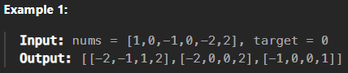
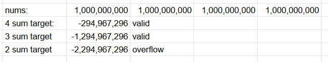

# 4sum

## Approach 1 - recursion + twoSum

- 经过了2sum, 3sum, 4sum...ksum，我们希望找到一个generic的解法去解决ksum
- 思路时把ksum 降维到2sum,然后用2sum的方法做就可以了

### example：

- 排序后为[-2, -1, 0, 0, 1, 2]
- index为[ 0,  1, 2, 3, 4, 5]
- 第一个数可以选择 -2， -1， 0（选择范围 < index 3, 保证要有四个数）
- 当一个数位-2时，第二个数可以选择 -1 or 0 (重复的0要跳过，选择范围不超过index 4)
    - 第二个数为 -1，开始twosum, 找到答案[-2, -1 , 1, 2]
    - 第二个数为 0，开始twosum, 找到答案[-2, 0, 0， 2]
    - 没有选择了
- 当一个数位-1时，第二个数只能选 0 (重复的0要跳过，选择范围不超过index 4)
    - 第二个数为 -0，开始twosum, 找到答案[-1, -0 , 0, 1]
    - 没有选择了
- 当一个数位0时：
    - 第二个数只有一种选择为0，开始twosum, 找不到答案
    - 没有选择了
- 结束

### 注意点
- base case 时当k= 2开始twosum
- quad里面只会有前两个数，第一个数不变，开始循环第二个数，每次return remove 第二个数
- 第二个数循环结束，第一个数也被remove, 变成下一个第一个数，remove这个操作非常必要
- 为什么target 要用long, sum也要用long?

- sum 在 这里不会overflow, -2 * 10^9<= sum <= 2 * 10^9, 
- 如果constraint 变了， sum也会overflow的话, 用long sum = (long)nums[left] + nums[right]

```java
class Solution {
    public List<List<Integer>> fourSum(int[] nums, int target) {
        List<List<Integer>> res = new ArrayList<>();
        List<Integer> quad = new ArrayList<>();
        Arrays.sort(nums); // Sort the array

        kSum(nums, 4, 0, (long) target, res, quad);
        return res;
    }

    private void kSum(int[] nums, int k, int start, long target, List<List<Integer>> res, List<Integer> quad) {
        // Base case: 2-Sum
        if (k == 2) {
            twoSum(nums, start, target, res, quad);
            return;
        }

        // Recursive case: reduce to (k-1)-Sum
        for (int i = start; i < nums.length - (k - 1); i++) {
            // Skip duplicates
            if (i > start && nums[i] == nums[i - 1]) continue;

            quad.add(nums[i]); // Include nums[i] in the current combination
            kSum(nums, k - 1, i + 1, target - nums[i], res, quad); // Recursive call
            quad.remove(quad.size() - 1); // Backtrack
        }
    }

    private void twoSum(int start, long target, int[] nums, List<List<Integer>> res, List<Integer> quad) {
        int left = start, right = nums.length-1;
        while (left < right) {
            int sum = nums[left] + nums[right]; // long sum = (long)nums[left] + nums[right] 如果sum也为overflow的话
            if (sum < target) {
                left++;
            } else if (sum > target) {
                right--;
            } else {
                List<Integer> temp = new ArrayList<>(quad);
                temp.add(nums[left++]);
                temp.add(nums[right--]);
                res.add(temp);
                while (left < right && nums[left] == nums[left-1]) left++; //去重
            }
        }
    }
}

```