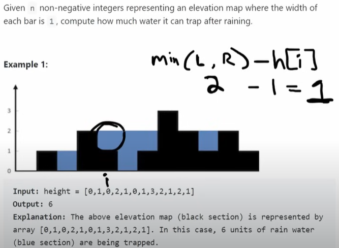
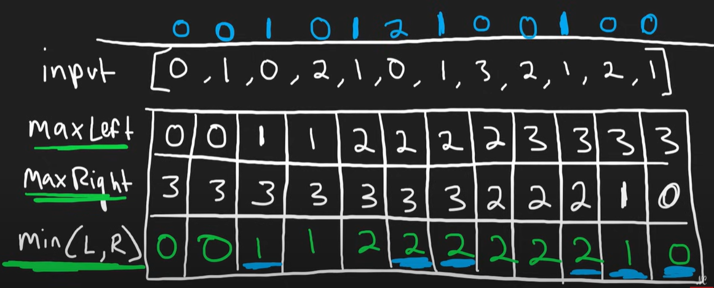
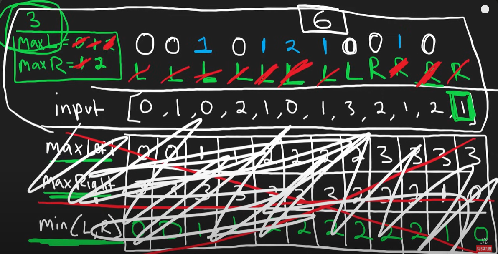

# 42. Trappign Tain Water

## Approach 1 - two pointers


- Method 1: time O(N), Space O(N)



- Method 2: more optimized, time O(N), sp0ace O(1)
    - postion idx 能装多少水，是由min of 左边最高的，和右边最高的 - 它自己的高度决定的，即 Min(left, right) -  height[i]
    - 我们用left pointer and right pointer
        - 分别track 左边最高的maxLeft，和右边最高的高度maxRight
        - 那边最高的矮，就移动那一边的指针
        - 指针移动到哪就计算哪里的train water值
        - 移动完了之后再更新maxLeft or maxRight，更新之后指针不动
        - 下一轮开始，比较maxLeft and maxRight, 哪边矮移动哪边



```java
class Solution {
    public int trap(int[] height) {
        int res = 0;
        int left = 0, right = height.length-1;
        int maxLeft = height[left], maxRight = height[right];

        while (left < right) {
            if (maxLeft <= maxRight) {
                left++;
                res += maxLeft - height[left] >= 0? maxLeft - height[left]: 0;
                maxLeft = Math.max(maxLeft, height[left]);
            } else {
                right--;
                res += maxRight - height[right] >= 0? maxRight - height[right]: 0;
                maxRight = Math.max(maxRight, height[right]); 
            }
        }

        return res;
    }
}
```

## Approac 2


```java

class Solution {
    public int trap(int[] height) {
        if (height.length == 0) return 0;
        int N = height.length, res = 0;
        int[] left = new int[N], right = new int[N];
        left[0] = height[0];
        right[N-1] = height[N-1];

        for (int i = 1; i < N; i++) {
            left[i] = Math.max(left[i-1], height[i]);
        }

        for (int i = N-2; i >= 0; i--) {
            right[i] = Math.max(right[i+1], height[i]);
        }
        
        for (int i = 0 ; i < N; i++) {
            int water = Math.min(left[i], right[i]) - height[i];
            res += water > 0? water: 0;  
        }

        return res;
    }
}

```