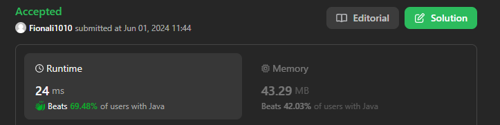
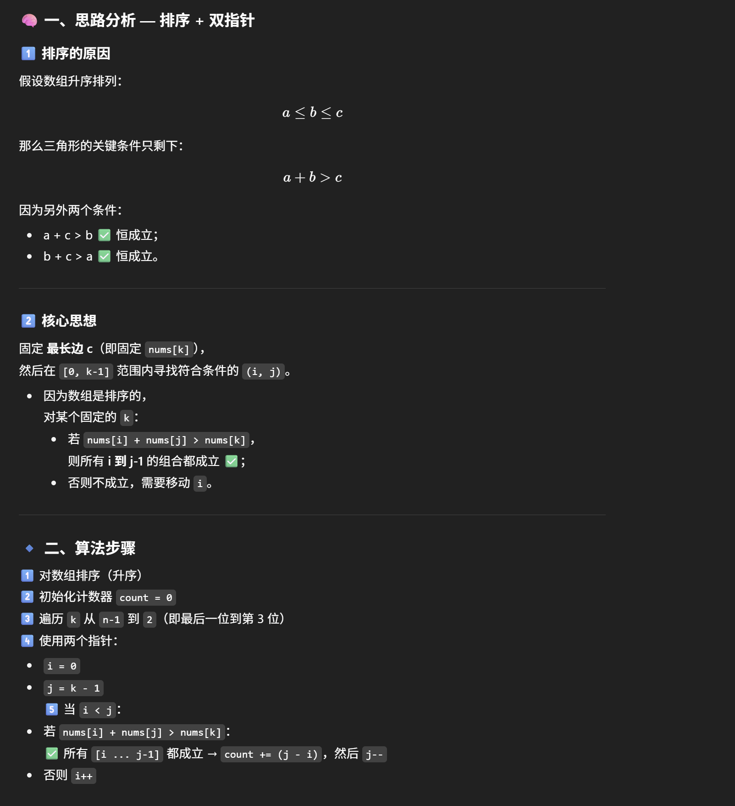
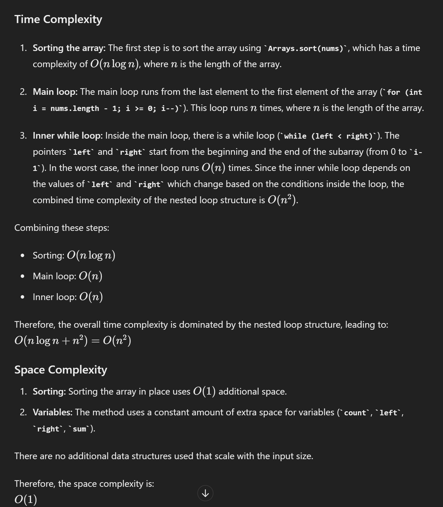

# 611. Valid Triangle Number



## Approach 1 - two pointers

- valid triangle的充要条件是 a <= b <= c && a+b > c
- 该题在排序之后，转换成要 a + b > C （和a+b = c有点像，考虑two pointers)
    - for循环c
- 一般让你求总数，都是批量解决
- 注意这道题时不能去重的，重复的数字也是可以用来做边的



```java
class Solution {
    public int triangleNumber(int[] nums) {

        Arrays.sort(nums); //O(nlogn)
        int count = 0;

        for (int i = nums.length-1; i >= 2; i--) { //O(n^2)
            int left = 0, right = i-1;
            while (left < right) {
                int sum = nums[left] + nums[right];
                if (sum <= nums[i]) {
                    left++;
                } else {
                    count += right-left;
                    right--; // here must right--, e.g [2,2,3,5,7,7,7,9]; 当i = 6时，前面每一个重复的7都可以用来组三角形
                }
            }
        }
        return count;
    }
}
```
