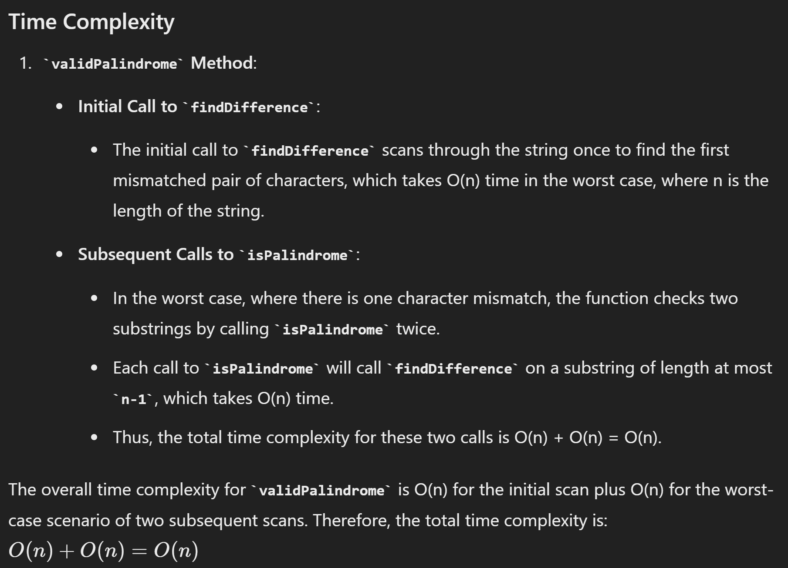
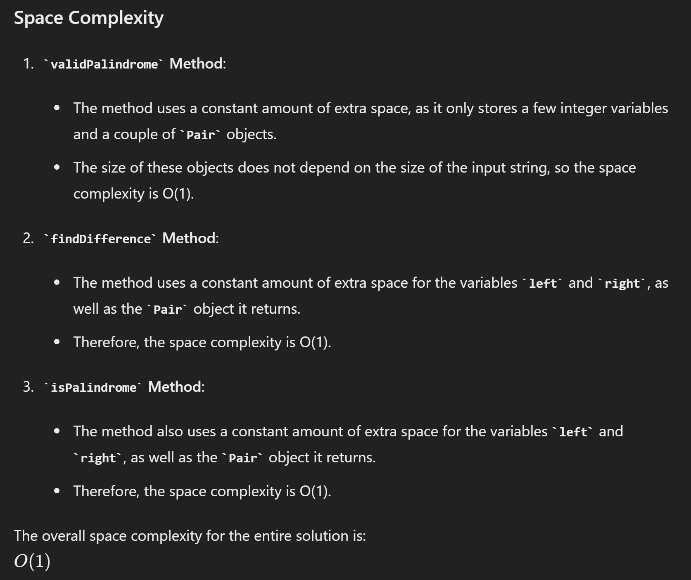

# 680. Valid Palindrome II

- 写法二

```java
class Solution {
    public boolean validPalindrome(String s) {
        int left = 0, right = s.length()-1;

        while (left < right) {
            if (s.charAt(left) == s.charAt(right)) {
                left++;
                right--;
            } else {
                // 如果发现不一致，还有一次机会
                return isPalindrome(s, left+1, right) || isPalindrome(s, left, right-1);
            }
        }
        return true;

    }

    private boolean isPalindrome(String s, int left, int right) {
        while (left < right) {
            if (s.charAt(left) == s.charAt(right)) {
                left++;
                right--;
            } else {
                return false;
            }
        }
        return true;
    }
}
```

- 写法二

```java
class Pair {
    int left, right;
    public Pair(int left, int right) {
        this.left = left;
        this.right = right;
    }
}

class Solution {
    public boolean validPalindrome(String s) {
        Pair pair = findDifference(s, 0, s.length()-1);
        // left >= right, means we did not find any difference;
        if ( pair.left >= pair.right) {
            return true;
        }

        return isPalindrome(s, pair.left, pair.right-1) || isPalindrome(s, pair.left+1, pair.right);
    }

    public Pair findDifference(String s, int left, int right) {
        while (left < right && s.charAt(left) == s.charAt(right)) {
            left++;
            right--;
        }
        return new Pair(left, right);
    }

    public boolean isPalindrome(String s, int left, int right) {
        Pair pair = findDifference(s, left, right);
        return pair.left >= pair.right;
    }
}

```


