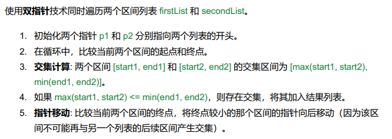

# 986. Interval List Intersections

## Approach 1 - two pointers



```java
class Solution {
    public int[][] intervalIntersection(int[][] firstList, int[][] secondList) {
        List<int[]> res = new ArrayList<>();
        
        // 1. 初始两个指针指向两个列表的开头
        int m = firstList.length, n = secondList.length;
        int p1 = 0, p2 = 0;

        // 2. loop比较两个区间的起点和终点
        while (p1 < m && p2 < n) {
            int start1 = firstList[p1][0], end1 = firstList[p1][1];
            int start2 = secondList[p2][0], end2 = secondList[p2][1];

            // 3. 判断是否有交集
            int maxStart = Math.max(start1, start2);
            int minEnd = Math.min(end1, end2);
            
            // 4. 存在交集 加入res
            if (maxStart <= minEnd) {
                res.add(new int[]{maxStart, minEnd});
            }

            // 5. 移动指针
            if (end1 < end2) {
                p1++;
            } else {
                p2++;
            }
        }

        return res.toArray(new int[0][]);
    }
}
```