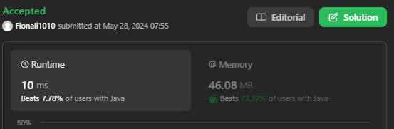

## Approach 1 - BFS using queue(a slow approach)


- do not add visited as we want to revisit some nodes;
- find shortest path need to add visited set;

```java
class Solution {
    public List<List<Integer>> allPathsSourceTarget(int[][] graph) {
        List<List<Integer>> paths = new ArrayList<>(); // answer
       
        Deque<List<Integer>> que = new ArrayDeque<>(); // to store current path
        List<Integer> path = new ArrayList<>();
       
        path.add(0);
        que.add(path);

        while (!que.isEmpty()) {
            List<Integer> currPath = que.poll();
            int lastNode = currPath.get(currPath.size() - 1);
            if (lastNode == graph.length - 1) {
                paths.add(new ArrayList<>(currPath));
                continue;
            } 
            for (int num : graph[lastNode]) {
                List<Integer> newPath = new ArrayList<>(currPath);
                newPath.add(num);
                que.add(newPath);
            }
        }
        return paths;
    }
}

// a very similar one - DFS using stack
class Solution {
    public List<List<Integer>> allPathsSourceTarget(int[][] graph) {
        List<List<Integer>> paths = new ArrayList<>(); // answer
       
        Deque<List<Integer>> stack = new ArrayDeque<>(); // to store current path
        List<Integer> path = new ArrayList<>();
       
        path.add(0);
        stack.push(path);

        while (!stack.isEmpty()) {
            List<Integer> currPath = stack.pop();
            int lastNode = currPath.get(currPath.size() - 1);
            if (lastNode == graph.length - 1) {
                paths.add(new ArrayList<>(currPath));
                continue;
            } 
            for (int num : graph[lastNode]) {
                List<Integer> newPath = new ArrayList<>(currPath);
                newPath.add(num);
                stack.push(newPath);
            }
        }
        return paths;
    }
}
```

## Approach 2 - DFS recursion (a faster approach)


```java
class Solution {
    // 记录所有路径
    List<List<Integer>> res = new LinkedList<>();
        
    public List<List<Integer>> allPathsSourceTarget(int[][] graph) {
        // 维护递归过程中经过的路径
        LinkedList<Integer> path = new LinkedList<>();
        traverse(graph, 0, path);
        return res;
    }

    /* 图的遍历框架 */
    void traverse(int[][] graph, int s, LinkedList<Integer> path) {
        // 添加节点 s 到路径
        path.addLast(s);

        int n = graph.length;
        if (s == n - 1) {
            // 到达终点
            res.add(new LinkedList<>(path));
            // 可以在这直接 return，但要 removeLast 正确维护 path
            // path.removeLast();
            // return;
            // 不 return 也可以，因为图中不包含环，不会出现无限递归
        }

        // 递归每个相邻节点
        for (int v : graph[s]) {
            traverse(graph, v, path);
        }
        
        // 重点是从路径移出节点 s
        path.removeLast();
        
    }
}
```